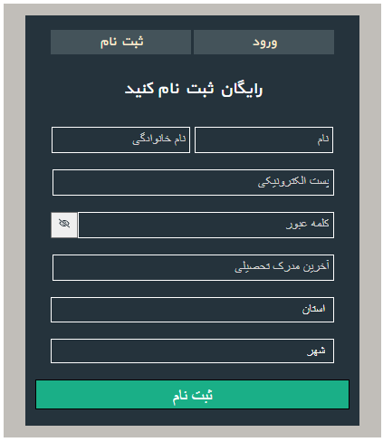
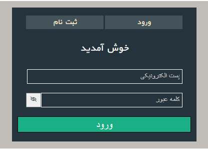

# Form-validation-in-sign-up-and-register
In q2 there is a react js app which I created a sign up and register form 
with form validation 

register | login |
--- | --- | 
 |  | 

q1 is a simple practice on useMemo
